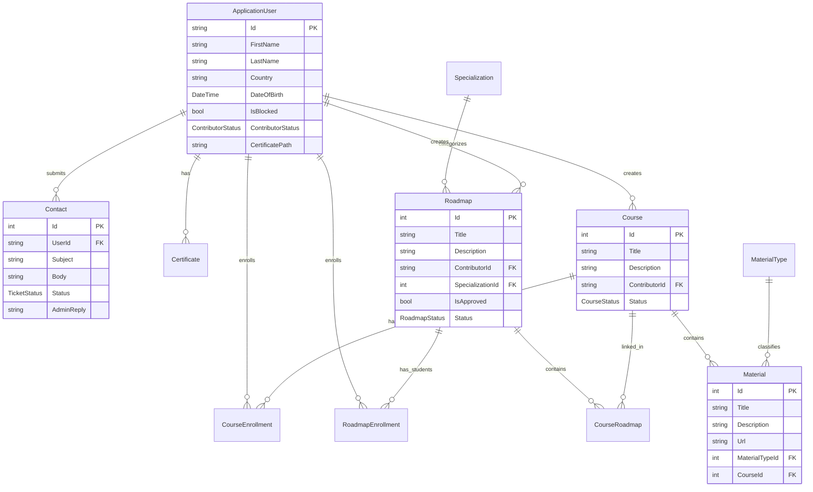

# 🗺️ StuMap — Learning Roadmap Platform

StuMap is a modern, high-performance web application designed to help students discover and follow structured, step-by-step learning roadmaps with curated educational materials. It eliminates the friction of searching for disparate learning resources by offering organized, specialization-specific learning paths created by approved industry contributors and moderated by administrators.

---

## 🎥 Demo Video

Watch a walk-through of the system features, user registration, contributor submissions, and admin moderation:

👉 **[Watch the Demo Video on YouTube/Loom](https://drive.google.com/file/d/1dl3AlcRtfW1LJgchqthoUo90LWYQVfIE/view?usp=drive_link)**

---

## 🚀 Tech Stack & Core Technologies

*   **Backend Framework:** ASP.NET Core MVC (.NET 10.0)
*   **Database & ORM:** Microsoft SQL Server & Entity Framework Core 10.0 (Code-First approach)
*   **Authentication & Authorization:** ASP.NET Core Identity (Role-Based Access Control with custom Claims mapping via `CustomClaimsPrincipalFactory`)
*   **Styling & UI:** TailwindCSS v4 and DaisyUI v5 (Dark-theme optimized design with modern glassmorphic overlays)
*   **External Integrations:** Firebase Admin SDK (used for token-based push notification structures)
*   **Task/Asset Compilation:** Node.js (Tailwind CLI processor)

---

## 👥 Role-Based Features & User Journeys

The platform operates on a strict **Role-Based Access Control (RBAC)** model with three primary user identities:

### 🎓 1. Student
*   **Browse Pathways:** Discover approved, structured learning roadmaps organized under specific academic/career specializations.
*   **Enrollment & Progression:** Enroll in courses and roadmaps, track completion, and manage personal schedules.
*   **Interactive Learning:** Access curated materials (articles, videos, textbooks, papers) within enrolled courses.
*   **Support System:** Open support and inquiry tickets directly to admins and view responses in a dedicated dashboard.

### ✍️ 2. Contributor
*   **Credential Verification:** Apply for contributor status by submitting academic certificates/professional credentials for admin verification.
*   **Content Creation:** Propose new courses, upload up to 5 educational materials per course, and attach external resource links.
*   **Roadmap Architecture:** Combine approved courses into multi-step sequential roadmaps for students.
*   **Personal Dashboard:** Edit and manage drafted or pending contributions.

### 🛡️ 3. Administrator
*   **Admin Dashboard:** Real-time analytics displaying statistics for students, contributors, courses, roadmaps, and pending requests.
*   **User Management:** Audit registered accounts, view profiles, and block/unblock users.
*   **Credential Moderation:** Review contributor registration files to approve or reject them with feedback.
*   **Content Moderation:** Approve, update, or reject submitted courses and roadmaps.
*   **Support Ticket Resolution:** Manage, reply to, or close user-submitted tickets.

---

## 📊 Domain Model & Database Architecture

StuMap uses Entity Framework Core to map its domain entities. Below is a visual representation of the core relationships:



### 🧬 Pre-Seeded Configurations
The application includes database seeders for instant onboarding and consistency:
*   **Roles:** `Admin`, `Student`, `Contributor`
*   **Specializations:** Computer Science, Information Technology, Software Engineering
*   **Material Types:** Article, Paper, Video, Image, Book, Exam, Other

---

## 📂 Project Structure

```
StuMap/
├── API/                    # Firebase and API configuration endpoints
│   └── Authentication/     # Authentication APIs & CustomClaimsPrincipalFactory
├── Context/                # EF Core Database Context (AppDbContext)
├── Controllers/            # MVC Controller Layer (Admin, Account, Student, etc.)
├── DataSeeding/            # Configuration files for initial seeding data
├── DTO/                    # Data Transfer Objects for API contracts
├── Managers/               # Repository interfaces (Business logic abstractions)
├── Models/                 # Database Entity Models and Enums
├── Services/               # Core business services and repository implementations
├── View Models/            # Strongly-typed models passed to Razor Views
├── Views/                  # Razor markup pages (.cshtml)
├── wwwroot/                # Static assets (site.css, compiled site.min.css, images)
├── appsettings.json        # Application configuration settings
└── package.json            # Tailwind CSS compiler configurations
```

---

## 🛠️ Getting Started & Local Setup

### Prerequisites
Before running the application, make sure you have the following installed:
*   [.NET 10.0 SDK](https://dotnet.microsoft.com/download/dotnet/10.0)
*   [Microsoft SQL Server](https://www.microsoft.com/en-us/sql-server/sql-server-downloads) (Express or LocalDB)
*   [Node.js (v18+) & npm](https://nodejs.org/)

### Installation Steps

1.  **Clone the repository:**
    ```bash
    git clone <repository-url>
    cd StuMap
    ```

2.  **Configure the Database Connection:**
    Open [appsettings.json](file:///e:/DEPI/Graduation_Project/DEPI_PROJECT/StuMap/appsettings.json) and verify the SQL Server connection string under `ConnectionStrings`:
    ```json
    "ConnectionStrings": {
      "StuMapDbConnection": "Server=.;Database=StuMapDb;Integrated Security=True;Encrypt=False"
    }
    ```

3.  **Run Database Migrations:**
    Deploy the database schema and seed data to your local SQL Server:
    ```bash
    dotnet ef database update
    ```

4.  **Install Node Dependencies & Process Tailwind CSS:**
    Install Tailwind CLI and DaisyUI to build the CSS distribution files:
    ```bash
    npm install
    npm run watch
    ```
    *Note: Leaving `npm run watch` running in a terminal will automatically recompile styles when changes are made to your views.*

5.  **Run the Application:**
    Start the development server:
    ```bash
    dotnet run
    ```
    The console will provide the local port (e.g., `https://localhost:7164`). Open this link in your browser to explore **StuMap**!

---

## 🛡️ License

Distributed under the ISC License. See `package.json` for details.
